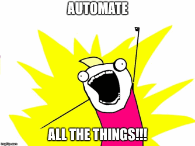

# Scripts to automate my life

- [wi.cmd](#wicmd) - Work with VSTS work items
- [pr.cmd](#prcmd) - Work with VSTS pull requests
- [gcal-cli](#gcal-cli) - Work with Google Calendar events
- [amp.cmd](#apmcmd) - Update my APM development environment



## wi.cmd

Work with VSTS Work Items. Requires the
[VSTS CLI](https://docs.microsoft.com/en-us/cli/vsts/overview?view=vsts-cli-latest)
be installed and configured.

Options:

- help      - Show this help
- start id  - Start work on a work item by marking it in-progress
- open id   - Opens a work item in the browser
- show id   - Shows a work item as JSON
- assigned  - Shows work items assigned to me
- kbr       - Shows KBR issues
- hockeyapp - Shows incoming HockeyApp issues

## pr.cmd

Work with VSTS Pull Requests.Requires the
[VSTS CLI](https://docs.microsoft.com/en-us/cli/vsts/overview?view=vsts-cli-latest)
be installed and configured.

Options:

- help      - Show this help
- open id   - Opens a pull request in the browser
- show id   - Shows a pull request as JSON
- assigned  - Shows pull requests assigned to me
- mine      - Shows pull requests I created

## gcal-cli

Third party [CLI for Google Calendar](https://github.com/toniov/gcal-cli)

Install `npm install -g gcal`

```
$ gcal insert 'Party tomorrow from 3pm to 5pm'

   Party: 2017-09-08T15:00:00+09:00 ~ 2017-09-08T17:00:00+09:00
   https://www.google.com/calendar/event?eid=amNpMWE5cjg2bG80n2s0Nmg1ZWlqcW01OXMgdG9rYWdlcm9oQG0
```

```
$ gcal list

   Upcoming events (2017-09-07T00:00:00+09:00 ~ 2017-09-07T23:59:59+09:00)
    2017-09-07 20:00 - My favorite TV show
    2017-09-07 22:30 - Prepare tomorrow's meeting stuff
```

## apm.cmd

Update my APM Development Environment

Options:

- help                    - Show this help
- current                 - Show the version of the latest APM build
- get cache               - Copies the current cache locally
- get apptest             - Copies the current app testing db locally
- get qabase              - Copies the current qa_base db locally
- get all                 - Copies the current cache and dbs locally
- restore all             - Unzips the cache and restores all dbs
- restore cache           - Unzips the cache
- restore apptest         - Restores the app testing db
- restore qabase          - Restores the qa_base db  help                    - Show this help
- restore localdb all     - Restores all dbs to localDB
- restore localdb apptest - Restores the app testing db to localDB
- restore localdb qabase  - Restores the qa_base db to localDB